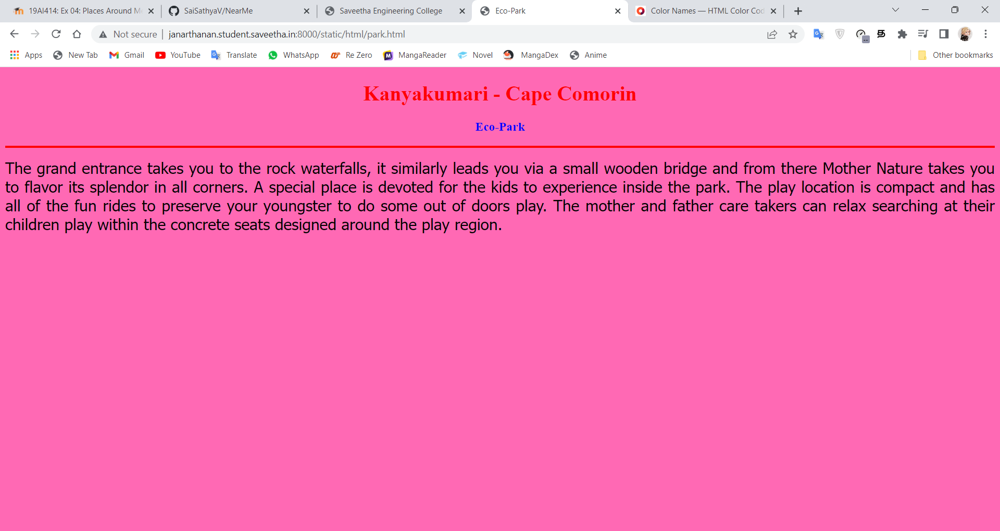
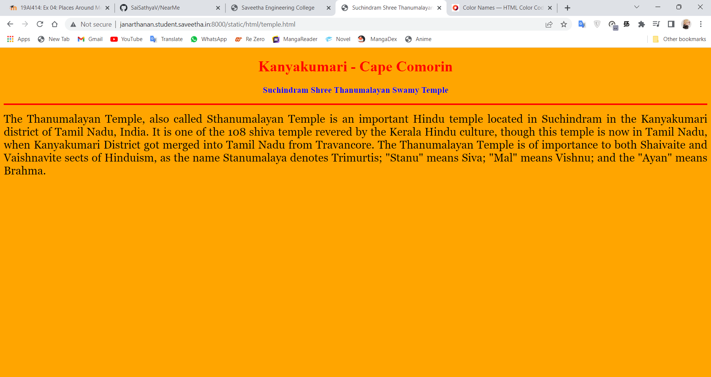
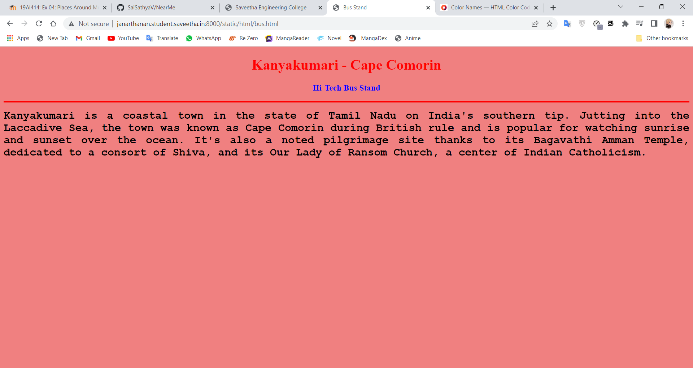
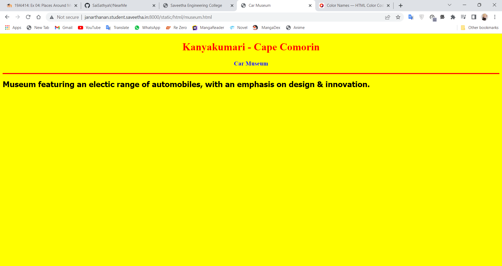
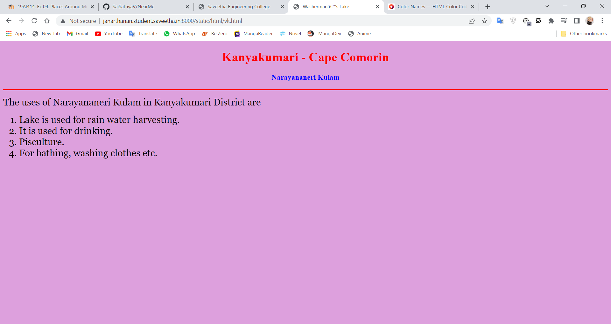
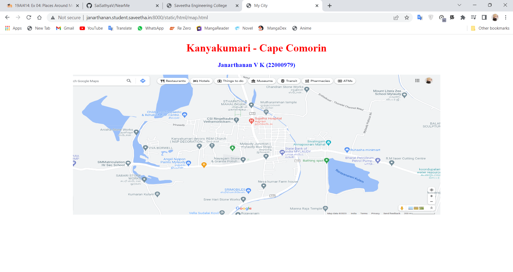
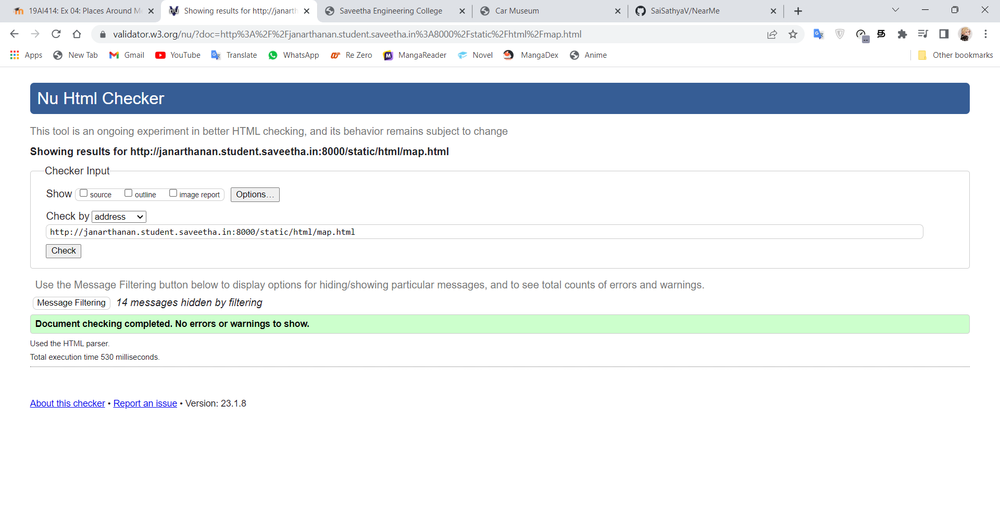

# Places Around Me
## AIM:
To develop a website to display details about the places around my house.

## Design Steps:

### Step 1:
Clone the github repository into Theia IDE.

### Step 2:
Create a Django project.

### Step 3:
Write the needed HTML code.

### Step 4:
Run the Django server and execute the HTML files.

## Code:
Include your HTML code here

```
map.html

<!DOCTYPE html>
<html lang="en">
<head>
<title>My City</title>
</head>
<body>
<h1 align="center">
    <font color="red"><b>Kanyakumari - Cape Comorin</b></font>
</h1>
<h3 align="center">
<font color="blue"><b>Janarthanan V K (22000979)</b></font>
</h3>
<center>

<map name="MyCity">
<area shape="circle" coords="190,50,20" href="/static/html/museum.html" title="Car Museum">
<area shape="rectangle" coords="230,30,260,60" href="/static/html/temple.html" title="Suchindram Shree Thanumalayan Swamy Temple">
<area shape="circle" coords="400,350,50" href="/static/html/vk.html" title="Narayananeri Kulam">
<area shape="circle" coords="400,200,75" href="/static/html/bus.html" title="Hi-Tech Bus Stand">
<area shape="rectangle" coords="490,150,870,320" href="/static/html/park.html" title="Eco-Park">

</map>
</center>
</body>
</html>

bus.html

<!DOCTYPE html>
<html lang="en">
<head>
<title>Bus Stand</title>
</head>
<body bgcolor="LightCoral">
<h1 align="center">
<font color="red"><b>Kanyakumari - Cape Comorin</b></font>
</h1>
<h3 align="center">
<font color="blue"><b>Hi-Tech Bus Stand</b></font>
</h3>
<hr size="3" color="red">
<p align="justify">
<font face="Courier New" size="5">
<b>
Kanyakumari is a coastal town in the state of Tamil Nadu on 
India's southern tip. Jutting into the Laccadive Sea, the town
was known as Cape Comorin during British rule and is popular 
for watching sunrise and sunset over the ocean. It's also a 
noted pilgrimage site thanks to its Bagavathi Amman Temple, 
dedicated to a consort of Shiva, and its Our Lady of Ransom 
Church, a center of Indian Catholicism.
</b>
</font>
</p>
</body>
</html>

museum.html

<!DOCTYPE html>
<html lang="en">

<head>
    <title>Car Museum</title>
</head>

<body bgcolor="yellow">
    <h1 align="center">
        <font color="red"><b>Kanyakumari - Cape Comorin</b></font>
    </h1>
    <h3 align="center">
        <font color="blue"><b>Car Museum</b></font>
    </h3>
    <hr size="3" color="red">
    <p align="justify">
        <font face="Tahoma" size="5">
            <b>
                Museum featuring an electic range of automobiles, with an emphasis on design & innovation.
            </b>
        </font>
    </p>
</body>

</html>

park.html

<!DOCTYPE html>
<html lang="en">
<head>
<title>Eco-Park</title>
</head>
<body bgcolor="HotPink">
<h1 align="center">
<font color="red"><b>Kanyakumari - Cape Comorin</b></font>
</h1>
<h3 align="center">
<font color="blue"><b>Eco-Park</b></font>
</h3>
<hr size="3" color="red">
<p align="justify">
<font face="Tahoma" size="5">
The grand entrance takes you to the rock waterfalls,
it similarly leads you via a small wooden bridge and
from there Mother Nature takes you to flavor its 
splendor in all corners. A special place is devoted for
the kids to experience inside the park. The play 
location is compact and has all of the fun rides to
preserve your youngster to do some out of doors play.
The mother and father care takers can relax searching
at their children play within the concrete seats designed 
around the play region.
</font>
</p>
</body>
</html>

temple.html

<!DOCTYPE html>
<html lang="en">
<head>
<title>Suchindram Shree Thanumalayan Swamy Temple</title>
</head>
<body bgcolor="orange">
<h1 align="center">
<font color="red"><b>Kanyakumari - Cape Comorin</b></font>
</h1>
<h3 align="center">
<font color="blue"><b>Suchindram Shree Thanumalayan Swamy Temple</b></font>
</h3>
<hr size="3" color="red">
<p align="justify">
<font face="Georgia" size="5">
The Thanumalayan Temple, also called Sthanumalayan Temple is an 
important Hindu temple located in Suchindram in the Kanyakumari
district of Tamil Nadu, India. It is one of the 108 shiva temple 
revered by the Kerala Hindu culture, though this temple is now in 
Tamil Nadu, when Kanyakumari District got merged into Tamil Nadu from 
Travancore. The Thanumalayan Temple is of importance to both 
Shaivaite and Vaishnavite sects of Hinduism, as the name Stanumalaya 
denotes Trimurtis; "Stanu" means Siva; "Mal" means Vishnu; and the "Ayan"
means Brahma.
</font>
</p>
</body>
</html>

vk.html

<!DOCTYPE html>
<html lang="en">
<head>
<title>Washerman’s Lake</title>
</head>
<body bgcolor="Plum">
<h1 align="center">
<font color="red"><b>Kanyakumari - Cape Comorin</b></font>
</h1>
<h3 align="center">
<font color="blue"><b>Narayananeri Kulam</b></font>
</h3>
<hr size="3" color="red">
<p align="justify">
<font face="Georgia" size="5">
The uses of Narayananeri Kulam in Kanyakumari District are 
<ol type="1">
<li>Lake is used for rain water harvesting.</li>
<li>It is used for drinking.</li>
<li>Pisculture.</li>
<li>For bathing, washing clothes etc.</li>
</ol>
</font>
</p>
</body>
</html>

```

## Output:












## HTML VALIDATOR


## Result:
The program for implementing image map is executed successfully.